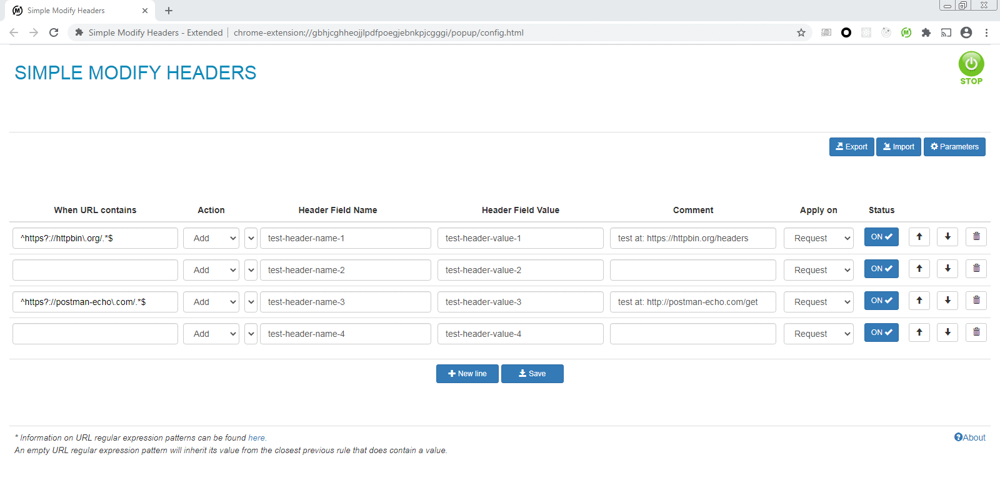

# [Simple Modify Headers - Extended](https://github.com/warren-bank/crx-simple-modify-headers/tree/extended)

## Forked from

[SimpleModifyHeaders](https://github.com/didierfred/SimpleModifyHeaders)
- version: [1.6.7](https://github.com/didierfred/SimpleModifyHeaders/releases/tag/v1.6.7)
- commit: [ea11a7a](https://github.com/didierfred/SimpleModifyHeaders/tree/ea11a7a52c7e6701f151bae3665cf455b26b94f2)
- date: 2020-08-31

## Summary of [changes](https://github.com/warren-bank/crx-simple-modify-headers/compare/smh-extended/v1.6.7..extended)

- "URL Pattern" _field_ is removed
  * previously:
    - held a ["match pattern"](https://developer.chrome.com/extensions/match_patterns)
    - was used to restrict access by the extension only to matching HTTP traffic
  * now:
    - the rules table is applied to all HTTP traffic
- "Filter URL per rules" _setting_ is removed
- "When URL contains" _field_
  * previously:
    - was active only when the "Filter URL per rules" _setting_ was enabled
    - held a string
    - was used to restrict the modification performed by the associated rule to only those URLs that contain the exact substring
  * now:
    - is always active
    - holds a case-insensitive [regular expression](https://perldoc.perl.org/perlre) pattern
    - is used to restrict the modification performed by the associated rule to only those URLs that match the regex pattern
    - can be left empty to inherit its value from the closest previous rule that does contain a regex pattern
- "Header Field Name" _field_ can optionally be chosen from a list of common values
- "Header Field Name" _field_ can fuzzy match substrings in "delete" rules by ending with the "*" character
- "Delete All" _button_ removes all rules
- "Import" _button_ reads rules from an external JSON text file
  * previously:
    - imported rules did __replace__ the pre-existing set of rules
  * now:
    - imported rules will __append__ to the pre-existing set of rules
- "Parameters" _button_ is renamed to "Settings"

- - - -

## Description

Extension for Firefox and Chrome.

The extension rewrites the headers based on a rules table.

The extension can be started and stopped via the button on the top right.

To save and apply the modification, you need to click on the save button.

It's possible to:
-  export the configuration into a file (json format)
-  import the configuration from a file. It supports the format of the Modifyheaders plugin

## Rules table

The rules table contains lines with the following parameters:
- action: add, modify or delete a header field
- header field name
- header field value
- comment: a comment
- apply on: "request" if the modification applies to the request headers or "response" if the modification applies to the response headers
- status: on if the modification is active, off otherwise

## Url pattern

We can choose the URLs on which the modifications are applied by modifying the URL pattern :
- The URL pattern must follow the syntax defined by https://developer.chrome.com/extensions/match_patterns
- Putting an empty string on the field will select all URLs
- It's possible to select multiple URL patterns using a semicolon (;) separator
- It's not possible to define a specific port number https://stackoverflow.com/questions/11425591/match-port-in-chrome-extension-pattern

## Parameters

The parameters button permits to:
- Activate debug mode: shows detailed log messages in the extension debugging console of the browser.
- Show comments: show comments field on the config panel
- Filter URL by rules: activate the possibility to filter URL for each rule in the config panel. The header field will be modified only if the URL contains the configured value.

## Firefox-specific issue

According to the version of Firefox, the addition of a new header behaves differently. In the latest version, when you choose the "add" action and the header exists, it appends the value, while in the old version, it replaces it. If you want to modify an exiting header, you should use "modify" instead of "add"

## Limitation

Due to limitations in the webRequest API of browsers, headers of requests, which are invoked by Javascript could not be modified.

## Extension permissions

In order to work, the following browser permissions are needed for the extension:
- storage: needed to store the configuration and the rules
- activeTab, tabs: needed to show the configuration screen in the browser tab.
- webRequest, webRequestBlocking ,<all_urls>: needed to modify the headers according to the rules table.

## License

The code is Open Source under [Mozilla Public License 2.0](https://www.mozilla.org/en-US/MPL/2.0/)

- - - -

## Screenshots

